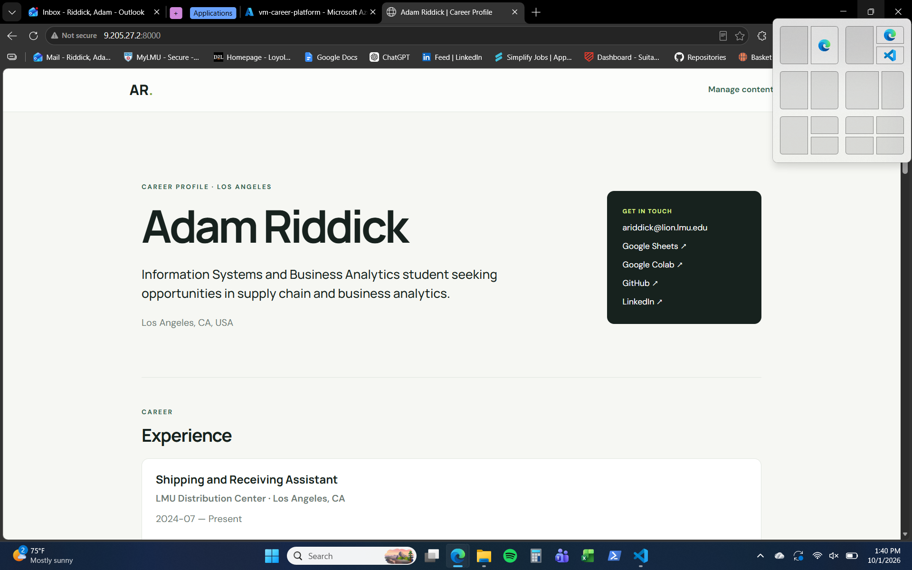

# Exercise 3: Azure VM Migration

## VM details

- **Name:** `vm-career-platform`
- **Resource group:** `rg-career-platform`
- **Region:** `DenmarkEast`
- **Size:** `Standard_B2ts_v2`
- **Public IP:** `9.205.27.2`

## Build and migration troubleshooting

SSH initially targeted the stale address `9.205.27.7`; updating the target to `9.205.27.2` allowed the connection. The first connection also reported an unknown host key. After confirming that no existing entry conflicted, the VM key was accepted with SSH's `accept-new` behavior, and a read-only hostname check succeeded.

The first Uvicorn attempt found that `/home/azureuser/career-platform` did not exist. Checks showed the VM had Git and Python but no application checkout or `uv`. The deployment configuration and FastAPI application were committed and pushed, then the updated repository was cloned and verified at commit `5c70f2a6a6607e019659d5c23ac3026727269e63`. Installing `uv` and running `uv sync --frozen` completed successfully.

The first `.env` verification failed because the file began with a UTF-8 byte-order mark. Inspecting its bytes identified the BOM; removing only those bytes preserved the `DATA_DIR` value and mode `600`. Verification then confirmed the exact line `DATA_DIR=/var/lib/career-platform`.

The personalized SQLite database was migrated and its integrity verified. Uvicorn reported application startup complete, the homepage returned successfully from a second SSH session, and the site was externally verified at <http://9.205.27.2:8000/> after the temporary `Temp-HTTP-8000` rule was opened.

A GET request to <http://127.0.0.1:8000/admin> on the Azure VM returned HTTP 200 HTML containing the expected profile, education, experience, projects, skills, certifications, volunteer experience, and links.

## The change

If the application moves to another computer, its SQLite database, `.env` settings, and installed dependencies do not move with the code, so it may fail to start or show missing or different data. To make it work there, install compatible Python, sync dependencies from `uv.lock`, recreate `.env` with the correct `DATA_DIR`, and restore a verified database backup to that path. Azure hosting costs include VM compute and storage while those resources are allocated; the exact dollar amount is not available from my records.
